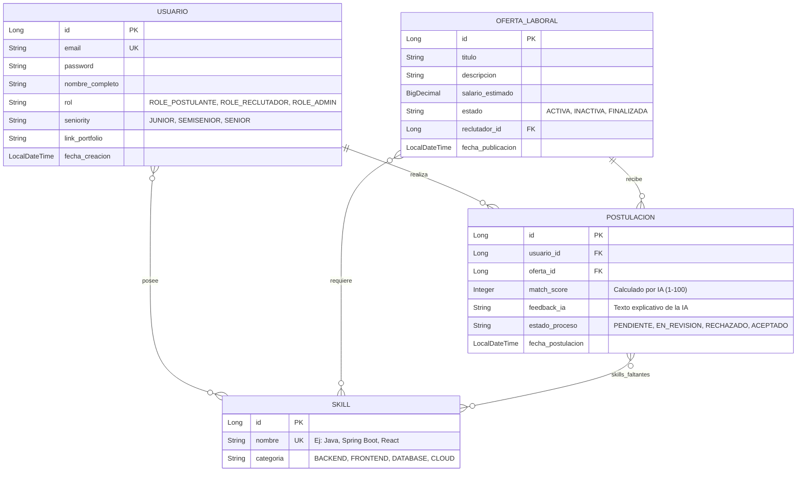

# ATS Smart (AI-Powered) - API RESTful

Bienvenido al repositorio de la API RESTful de **ATS Smart**, un sistema inteligente de análisis de currículums y ofertas laborales desarrollado en **Java 21**, **Spring Boot 3.x** y **Spring Data JPA**. El objetivo principal de esta aplicación es automatizar y optimizar el proceso de reclutamiento mediante el uso de inteligencia artificial para evaluar la compatibilidad de los candidatos respecto a los requisitos de las vacantes publicadas.

---

## 📊 Diagrama Entidad-Relación (DER)

A continuación se detalla la estructura física y lógica de la base de datos diseñada para soportar el flujo de análisis inteligente:



---

## 🛠️ Tecnologías y Dependencias Core

El proyecto cuenta con las siguientes tecnologías clave:
* **Java 21**: La versión LTS más estable y de mayor rendimiento de Java.
* **Spring Boot 3.x**: Framework ágil para el desarrollo corporativo en capas.
* **Spring Data JPA**: Abstracción ORM para simplificar el acceso a datos.
* **Spring Security**: Para el control de autenticación y autorización basado en roles.
* **Jakarta Validation**: Anotaciones declarativas para validar la entrada de datos.
* **MySQL Driver**: Controlador JDBC para la base de datos relacional.
* **Lombok**: Automatización de código repetitivo (Getters, Setters, Constructor, Builders).

---

## 📁 Arquitectura Limpia en Capas

El backend está diseñado siguiendo un flujo desacoplado y robusto en capas independientes:

```
└─ src/main/java/com/atssmart/api
   ├─ controller     # Controladores REST (Manejan peticiones HTTP y validan DTOs de entrada)
   ├─ dto            # DTOs (Data Transfer Objects)
   │  ├─ request     # Modelos de validación de entrada del cliente (Jakarta Validation)
   │  └─ response    # Modelos seguros y limpios de salida expuestos al cliente
   ├─ enums          # Enums de negocio seguros (Roles, Seniority, Estados)
   ├─ exception      # Centralizado de Errores con @RestControllerAdvice y Custom Exceptions
   ├─ mapper         # Traductores de objetos (aisla las entidades JPA de la capa API)
   ├─ model          # Entidades JPA que representan las tablas de base de datos
   ├─ repository     # Interfaces de acceso a base de datos (Spring Data JPA)
   └─ service        # Interfaces e implementación de reglas de negocio transaccionales
```

---

## 📋 Requisitos del Sistema (RF / RNF)

La especificación formal de los **Requisitos Funcionales** y **No Funcionales** del sistema ha sido organizada en un documento dedicado:
* 👉 Consulta la lista completa en **[requisitos.md](file:///c:/Users/gc/Documents/ats-smart-api/requisitos.md)**

---

## 🚀 Cómo Iniciar el Proyecto en Desarrollo

Para ejecutar y probar la API localmente, sigue los siguientes pasos:

### 1. Requisitos Previos
* **Java 21** instalado en tu sistema.
* **Maven** para la gestión de dependencias y construcción del proyecto.
* **MySQL Server** corriendo localmente o en un contenedor docker.

### 2. Configurar la Base de Datos
Crea una base de datos en tu servidor MySQL:
```sql
CREATE DATABASE ats_mini_db CHARACTER SET utf8mb4 COLLATE utf8mb4_unicode_ci;
```

Abre el archivo `src/main/resources/application.properties` y configura las credenciales de tu servidor de base de datos MySQL:
```properties
spring.application.name=ats-smart-api

# MySQL DataSource Configuration
spring.datasource.url=jdbc:mysql://localhost:3306/ats_mini_db?useSSL=false&serverTimezone=UTC&allowPublicKeyRetrieval=true
spring.datasource.username=TU_USUARIO_MYSQL
spring.datasource.password=TU_CONTRASEÑA_MYSQL
spring.datasource.driver-class-name=com.mysql.cj.jdbc.Driver

# JPA & Hibernate Settings
spring.jpa.hibernate.ddl-auto=update
spring.jpa.show-sql=true
spring.jpa.properties.hibernate.format_sql=true
spring.jpa.properties.hibernate.dialect=org.hibernate.dialect.MySQLDialect
```

### 3. Ejecutar la Aplicación
Navega a la carpeta raíz del proyecto y ejecuta el siguiente comando en tu consola de comandos:
```bash
mvn spring-boot:run
```

El servidor web se iniciará de forma predeterminada en el puerto **8080**. Puedes probar el endpoint base de usuarios enviando peticiones HTTP a `http://localhost:8080/api/users`.
